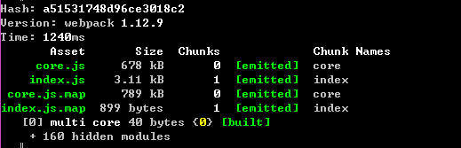
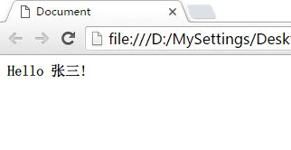

## 题记

> 声明：我会以一个后端开发人员（类  C 语言）的身份来做前端的开发，但是需要一些前端基础知识，比如：HTML 标记、DOM 文档等。
>
> 除此之外需要安装有 Node.js 4.0+ 版本，最好在 [GitHub](https://github.com/Lenic/react-scaffold) 上 Clone 本文源码。

传统的 Web 开发中，写 js 代码很少考虑面向对象、模块化，因为没有这方面的要求，也没必要。传统的 Web 开发，前端仅仅负责数据的展示，很少或根本不负责动态交互。

随着页面越加复杂，页面的交互越来越多，势必增加 js 的权重，不考虑面向对象、没有模块化的 js 很可能会导致代码结构的崩塌。另一方面，后端语言（比如 C#、Java 等）却可以很轻松的完成复杂逻辑的编写工作。

这使得人们开始重新思考 js 的定位。2013 年横空出世的 React 框架，加上定稿的 ES6 语法，终于赋予了前端模块化定制的能力。

## 一个简单的例子

```js
import React, {Component} from 'react';

export default class HelloMessage extends Component {
  constructor(props, context) {
    super(props, context);
  }

  render() {
    return (
      <div>Hello {this.props.name}!</div>
    );
  }
}
```

以上代码就是一个通常的理解的**类**，按照规范单独成一个文件，有自己的构造函数和 `render` 方法。

1. 构造函数在 `new` 的时候调用。
1. `render` 方法根据名字判断是渲染成 HTML 文档。
1. 引入了一个已有的模块 `react`，从之继承。

以上，就是作为后端开发，咱一眼能看出来的东西。事实呢，也确实如此！

1. 构造函数不用讲了，`super` 关键字指向了父类的相关信息，这个必须在构造函数第一行。
1. `render` 方法会把 `return` 返回的 HTML 元素，在适当的时机，添加到 DOM 文档中去。
1. 至于 `import` 语句，是 ES6 语法固定的写法，就好比 C# 的 `using` 语句。
1. `export default` 可以类比成 C# 里面的 `public` 关键字，这样才能在别的类中调用；可以省略，表示只在当前文件可见，相当于添加了 `private` 关键字。

### 连接 HelloMessage 模块

就好像 C# 代码需要一个入口点函数一样，模块化的 js 需要一个入口文件：

```js
import React from 'react';
import ReactDOM from 'react-dom';

import HelloMessage from './HelloMessage.jsx';

ReactDOM.render(<HelloMessage name="张三" />, document.getElementById('container'));
```

解释下这段代码：

1. 导入 React 框架的渲染类、HelloMessage 模块类。
1. 将 HelloMessage 模块类渲染到 `id='container'` 元素上

## 编译 js 文件

是的，你没看错，即使是 js 仍然需要编译才能运行。编译这块我不多解释了，这次的任务主要是带领大家得到一个以后端形式编写的页面。

在控制台中键入 `npm start` 后u看到如下图所示的结果后即表示构建完成：



此时，双击根目录下的 index.html 就能看到最终结果了：



## 引入到 `.html` 文件并运行

在 `.html` 文件中引入编译后的 js 文件，点击在浏览器中打开。

```html
<html>
<head>
  <meta charset="UTF-8">
  <title>Document</title>
</head>
<body>
  <div id="container"></div>
  <script src="dist/core.js" charset="utf-8"></script>
  <script src="dist/index.js" charset="utf-8"></script>
</body>
</html>
```

## 一些必要的说明

DEMO 运行起来了，我们能看到的只是出现了一行文字而已，距离理想中高大上的网页，还有十万八千里，但是我们已经迈出了第一步，剩下的就是把这段路走完而已。

1. 前端代码模块化后，开发过程中是需要拆分文件的，规范的做法是一个模块一个文件，类比到 C# 代码就是一个 `class` 一个 cs 文件。
1. 拆分各个模块后，模块间的相互引用，需要使用 `export default` 和 `import` 语法来导出和导入，类比到 C# 代码就是 `public` 关键字和文件头的 `using` 语句。
1. 入口文件是必须的。就好像 C# 控制台程序，从 `Program.Main` 方法启动。因为 js 是按照代码从上往下执行的，所以 js 入口文件需要先 `import` 需要的模块，调用 `ReactDOM.render` 方法将目标模块渲染到目标元素上。
  + 目标模块需要传递的参数，按照 attribute 的形式添加到元素中。
  + 注意引入的模块首字母必须是大写的，这是 React 的约定，防止和原生的 HTML 组件名称冲突，比如：div 就是 HTML 元素，HelloMessage 是咱写的组件。
1. 在 `.html` 文件中以 `script` 引入编译后的文件，这里是引入了两个文件：
  + `core.js` 表示公共模块，好比 C# 运行中需要的 `System.dll` 文件。
  + `index.js` 表示咱写的 js 代码。
